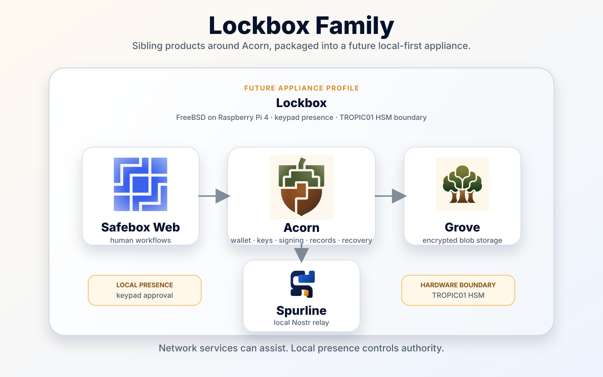
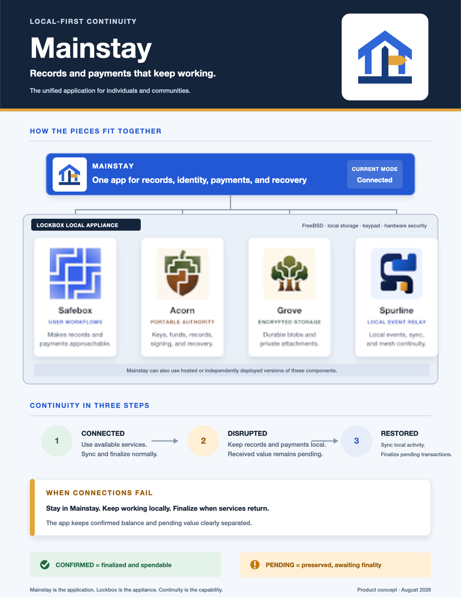

# Mainstay and Lockbox Product Vision

## A community continuity scenario

A satellite link goes down. A distant cloud service starts behaving
unpredictably. A tornado takes out the local registry office and bank. Solar
power and backup systems are keeping the electricity on, but the community has
lost access to much of what it needs to function: payment services, critical
records, local evidence, and the remote systems used to coordinate them.

The people, funds, and records have not disappeared. Access to the distant
infrastructure has. Mainstay provides the local point of continuity, while a
Lockbox gives the application and its supporting services a dedicated local
home. Together they let the community use resources already within reach and
reconcile with external systems when connectivity returns.

## Summary

**Mainstay** is the future unified local-first application for the Acorn stack.
**Lockbox** is the hardware-first appliance product that provides a dedicated
local home for Mainstay and its supporting services.

Together, they bring Acorn, Safebox Web, Grove, Spurline, and optional Clear
mints into a coherent experience for individuals, organizations, and
communities that want custody, records, payments, storage, local currencies,
and relay continuity under local control.

The ordinary user experience can still be web-connected. A person may use a
hosted Safebox Web service in normal conditions, then fall back to their local
Lockbox when a provider, service, or internet connection is unavailable. The
future Mainstay app should provide the same user entry point across those modes
rather than becoming a separate emergency-only tool.

The initial target platform is:

```text
FreeBSD on Raspberry Pi 4
with a physical keypad and TROPIC01 HSM
```

Lockbox should feel like an appliance rather than a hosted web application. It
should boot predictably, run locally, expose a clear local web interface, keep
state on durable local storage, and use hardware-backed controls for sensitive
authority.

The existing sibling architecture is the foundation Mainstay will unify:



This first architecture graphic predates Clear. Clear now sits beside Grove and
Spurline as an optional local service; the textual architecture below is the
current product model.

The letter-sized continuity poster provides a simpler operational view suitable
for printing and quick reference:



[Print-ready PDF](./assets/mainstay-lockbox-continuity-poster.pdf) |
[Editable vector SVG](./assets/mainstay-lockbox-continuity-poster.svg)

## Product naming

The working product hierarchy is:

- **Mainstay** is the unified application and primary user entry point for
  records, identity, payments, synchronization, and continuity modes.
- **Lockbox** is the hardware-first appliance and integrated local deployment
  for Mainstay and the supporting stack.
- **Safebox Web** is the current standalone user application and an important
  foundation for Mainstay. It remains independently useful rather than being
  prematurely renamed or absorbed.
- **Acorn, Grove, Spurline, and Clear** remain independent protocol and
  infrastructure components used by Mainstay and optionally packaged by
  Lockbox.
- **Continuity** is the capability that joins the product: records and payments
  remain available across connected, local, mobile, and community conditions.

The compact expression is:

```text
Mainstay is the application.
Lockbox is the appliance.
Continuity is the capability.
```

Mainstay should be able to run without dedicated Lockbox hardware on a hosted
service, laptop, phone, community server, or other compatible environment.
Lockbox is the preferred integrated deployment when durable local operation,
hardware-backed controls, and appliance simplicity matter.

## Product relationship

Acorn remains the protocol runtime at the center of the system. The sibling
products use Acorn or are used by Acorn:

- **Acorn**: wallet, identity, signing, record, and protocol runtime.
- **Safebox Web**: user app for custody, records, offers, grants, payments,
  handles, and workflows; the current application foundation for Mainstay.
- **Grove**: local-first Blossom storage for encrypted blobs and attachments.
- **Spurline**: local-first Nostr relay for event continuity, community
  infrastructure, and mesh synchronization.
- **Clear**: optional local-first Cashu mint for independently governed points,
  vouchers, and internal economies without Bitcoin or Lightning settlement.
- **Mainstay**: future unified application and primary entry point across the
  sibling products.
- **Lockbox**: hardware-first appliance that runs Mainstay and the full stack
  locally.

The intended relationship is:

```text
Lockbox hardware appliance / local deployment
|
+-- Mainstay: unified user application
|   |
|   +-- Safebox Web: current application foundation
|   +-- Grove: encrypted blob storage
|   +-- Spurline: local relay
|   +-- Clear: optional local currency and voucher mint
|   \-- Acorn: wallet, keys, signing, records, and recovery
|
\-- Hardware and operating boundary
    +-- FreeBSD
    +-- TROPIC01 HSM
    \-- keypad presence and approval
```

Outside Lockbox, Mainstay can use compatible hosted or independently deployed
instances of the same components.

Lockbox should not collapse these products into a monolith. Each component
should remain independently useful, testable, and replaceable. Lockbox provides
the integrated runtime, operating profile, hardware boundary, and local
operator experience.

## Positioning

Working sentence for Mainstay:

```text
Mainstay is a local-first application for records, identity, payments, and
community resource coordination that keeps working across connected and
disrupted conditions.
```

Working sentence for Lockbox:

```text
Lockbox is the dedicated local appliance that runs Mainstay and its supporting
services for individuals, organizations, and communities.
```

Alternate:

```text
Lockbox is the local home for the Acorn stack: custody, records, storage, and
relay continuity, with optional local currencies, running under your control.
```

The product should emphasize practical local continuity rather than isolation.
Network services can assist, but local presence controls authority.

## Appliance model

The target Lockbox appliance combines:

- **FreeBSD** as the base operating system.
- **Raspberry Pi 4** as the initial low-cost hardware target.
- **Mainstay** as the future unified user application.
- **Safebox Web** as the current local user interface and foundation for
  Mainstay.
- **Acorn** as the wallet, identity, signing, record, and recovery runtime.
- **Grove** as the local encrypted blob store.
- **Spurline** as the local Nostr relay.
- **Clear** as an optional local mint for organization-defined currencies and
  vouchers that do not depend on Bitcoin or Lightning.
- **TROPIC01 HSM** as the hardware-backed key protection and signing boundary.
- **Keypad** as the physical presence and approval interface.

The keypad and HSM are not decorative peripherals. They define the custody
boundary:

- the keypad supports local presence, PIN entry, unlock, approval, and recovery
  flows;
- the HSM protects key material and constrains sensitive operations;
- the web interface can request authority, but local hardware should approve or
  deny high-risk actions.

## Design principle

```text
Network services can assist, but local presence controls authority.
```

This principle should shape both the product experience and the internal
architecture:

- remote relays may help with availability, but Spurline preserves local event
  continuity;
- remote storage may be useful, but Grove preserves local encrypted blobs;
- external mints may provide globally connected payments, while Clear can
  provide bounded local currency under an organization's own treasury policy;
- web workflows may be convenient, but Acorn owns the protocol runtime;
- browser sessions may request actions, but keypad and HSM-backed policies
  should govern sensitive authority;
- hosted operators may provide support, but Lockbox should keep a credible path
  to local continuity.

## FreeBSD platform

FreeBSD is not just an implementation detail. It supports the appliance
direction by encouraging a small, inspectable, service-oriented deployment
model:

- predictable service supervision;
- conservative package and operating-system boundaries;
- clear filesystem layout;
- strong networking primitives;
- jails as a future isolation strategy;
- boring startup and shutdown behavior;
- suitability for long-running local infrastructure.

The initial Raspberry Pi 4 target imposes useful constraints: low power,
limited resources, local storage, simple thermal behavior, and a small physical
footprint. Those constraints should keep the stack disciplined.

## Continuity modes

Lockbox should give the user app a clear vocabulary for how it is operating:

| Mode | Meaning |
| --- | --- |
| **Connected Mode** | Normal use with upstream internet, hosted services, relays, external mints, local Clear currencies, synchronization, and updates available. |
| **Local Mode** | Direct local use of the Lockbox appliance without upstream internet; the user reaches local Acorn, Spurline, Grove, and any configured Clear mint nearby. |
| **Mobile Mode** | A phone or other nearby device provides temporary upstream connectivity while Lockbox remains the local authority environment. |
| **Community Mode** | Nearby Lockboxes or participating devices exchange signed events, encrypted records, replicas, and provisional payment messages through local or mesh transport. |

The app can hardcode **Connected Mode** at first. Later releases can determine
mode from actual service reachability, local pairing state, bridge state, and
community mesh participation.

## Local internal economies with Clear

**Clear** adds an optional local-first mint to the Mainstay family. It uses
Cashu bearer proofs for private transfer and double-spend protection, but it
does not issue against Lightning invoices or redeem to Lightning. A currency
root authority establishes governance, authorized treasurers approve issuance
and retirement, and participating people and providers decide whether to
recognize that specific currency.

This makes Clear suitable for organizations and communities that want an
internal economy without adopting Bitcoin or operating Lightning
infrastructure. Examples include:

- a church coordinating meal, transportation, or benevolence vouchers;
- a food-bank network issuing credits recognized by participating providers;
- a campus, event, camp, or community association allocating services;
- an emergency operation coordinating scarce local supplies; and
- a resort running guest credits, staff allowances, activity vouchers, or a
  localized payment system on its own network.

The resort case shows how the pieces fit together. The resort treasury funds
the program and governs issuance. A local Clear mint issues a resort-specific
currency. Guests and staff hold proofs in Acorn-backed wallets, and recognized
shops, restaurants, and activity providers accept them. Providers return
proofs for retirement and receive the reimbursement or internal accounting
treatment promised by resort policy.

```text
Resort or community authority establishes policy
                    |
                    v
Treasurers issue a bounded Clear currency
                    |
                    v
People transfer it among recognized local providers
                    |
                    v
Providers return proofs for retirement and settlement
```

The currency is not legal tender and does not need universal recognition. Its
purpose is coordination inside a known network. Ordinary money may fund the
program and settle with providers, while Clear supplies cash-like possession,
direct transfer, optional acceptance, and privacy between issuance and
redemption.

Clear also strengthens local continuity. If Clear runs on Lockbox or another
organization-controlled server, wallets on the local network can continue to
validate, swap, issue, and retire that currency without reaching Bitcoin,
Lightning, or the global internet. This differs from a Continuity Payment made
with proofs from an unreachable external mint: external proofs remain
provisional until their mint returns, while a reachable local Clear mint can
provide mint-level finality for its own currency inside the local network.

Clear remains an optional sibling product. Mainstay should discover and
present Clear currencies when configured, keep each currency and issuer
distinct, and make its recognition and redemption policy understandable.
Lockbox should not silently create a currency or turn every appliance owner
into a mint operator.

## Continuity Payments

**Continuity Payments** are a powerful future Lockbox capability: Acorns should
be able to keep making local payments to one another when the wider network,
Lightning, or Cashu mints are unavailable.

The user-facing idea is simple:

```text
When ordinary payment infrastructure is unavailable, nearby Acorns can still
transfer previously issued ecash locally and reconcile with mints later.
```

Under the hood, this is an in-kind ecash transfer. The payment object itself is
transferred: previously issued Cashu proofs move from one Acorn to another
rather than being settled immediately through Lightning or refreshed at the
mint.

This creates a useful continuity path for individuals, organizations, and
communities:

- a remote community can keep local commerce moving during a satellite or
  upstream internet outage;
- a ship, camp, clinic, or field operation can keep ordinary small payments
  working while its upstream link is blocked, expensive, or intermittent;
- an organization can continue limited local operations while payment
  infrastructure is degraded;
- two Acorns can exchange bearer proof material through local network, mesh, or
  appliance-mediated transport;
- Spurline can preserve the local payment events and evidence;
- when connectivity returns, Acorn can contact the relevant mints to refresh or
  swap received proofs and determine finality.

### Scenario: local commerce during intermittent connectivity

Imagine a community that normally uses a Cashu mint connected to global payment
infrastructure. In ordinary **Connected Mode**, people can deposit, pay,
receive, and reconcile normally. Their Acorns hold spendable proofs issued by
the mint, and the mint provides final spend-state confirmation.

Now the upstream link becomes unreliable. A cruise ship may lose or ration its
satellite connection. A remote community may have a shared satellite service
that is sketchy at best. An emergency site may retain a local network while
internet, mobile service, banks, and Lightning routes are unavailable.

Inside the local environment, people are not isolated from each other. They may
still have Wi-Fi, local Ethernet, Bluetooth, LoRa, a mesh network, or a
Lockbox-hosted Spurline relay. Continuity Payments let participating Acorns
continue small local transfers using ecash they already hold:

```text
connected period
  -> wallets receive mint-issued proofs
link degraded or blocked
  -> local Acorns transfer selected proofs to each other
  -> Spurline preserves payment events and evidence
connectivity restored
  -> receiving Acorns refresh or swap proofs with the mint
  -> final spend state is reconciled
```

This does not make Lockbox a mint, bank, or global settlement network. It gives
the community a practical local payment continuity layer while the global
payment path is unavailable. The user app should keep that boundary visible:
local transfer now, mint finality later.

Continuity Payments are not the same as final mint settlement. Until the mint
is reachable, the receiver cannot know with mint-level certainty that the
proofs have not also been spent or transferred elsewhere. Lockbox should make
that state explicit:

```text
local transfer accepted
mint finality pending
reconciliation required when connected
```

The product should also handle non-exact payments. When the mint is offline,
Acorn may not be able to swap proofs to make exact change. The user app should
calculate the closest transferable proof set and ask for explicit approval:

```text
Requested: 100 sats
Transferable now: 96 sats
Difference: -4 sats
Status: provisional until mint refresh
```

or:

```text
Requested: 100 sats
Transferable now: 104 sats
Difference: +4 sats
Status: provisional until mint refresh
```

That keeps the user in control and avoids pretending that local continuity is
the same as external finality.

## Component roles inside Mainstay and Lockbox

### Mainstay

Mainstay is the unified user application. It should provide the primary entry
point for records, identity, payments, recovery, synchronization, continuity
mode, and device status without becoming the underlying system of record.

Mainstay coordinates the sibling products through their supported boundaries.
It should be deployable independently while also serving as the standard user
experience on Lockbox hardware.

### Safebox Web

Safebox Web is the current standalone user app and the practical foundation
for Mainstay. It provides browser workflows for records, custody, offers,
grants, payments, recovery, and continuity.

Safebox Web should not become the system of record. It uses Acorn and presents
flows around it.

### Acorn

Acorn is the continuity and authority runtime. It coordinates keys, signing,
wallet state, Nostr events, encrypted records, transfer flows, and recovery
material.

Acorn should remain protocol-first and usable outside Lockbox.

### Grove

Grove provides local-first Blossom storage for opaque encrypted blobs and
attachments. It should store bytes durably without needing to understand the
plaintext records they represent.

### Spurline

Spurline provides the local-first Nostr relay. It should preserve events
locally, support continuity during network disruption, and eventually
participate in selective synchronization with the broader relay network and
local mesh.

### Clear

Clear provides optional local-first currencies for organizations and
communities. It separates currency-root governance, mint operation, and
treasurer authorization while issuing standard Cashu-style bearer proofs under
an experimental non-Lightning settlement method.

Clear should remain independently deployable. Mainstay and Acorn may use it,
and Lockbox may host it, but its currency policy and ledger remain a distinct
organizational authority boundary.

### TROPIC01 HSM

The TROPIC01 HSM is the intended hardware-backed trust boundary for sensitive
key material and signing operations. The integration should be designed so that
software compromise does not automatically imply unrestricted key use.

### Keypad

The keypad provides local presence. It should support flows such as unlock,
approve, deny, reset, and recovery confirmation without requiring trust in a
remote browser session.

## Early product requirements

Lockbox should eventually provide:

- single-device local startup for all stack services;
- predictable local URLs and ports;
- a clear continuity-mode indicator in the user app;
- health and status views for Acorn, Safebox Web, Grove, Spurline, and any
  configured Clear currency;
- local data directories with clear backup and migration semantics;
- service supervision and restart behavior suitable for FreeBSD;
- HSM initialization and health checks;
- keypad enrollment and approval flows;
- safe shutdown and restart behavior;
- local recovery and export flows;
- minimal dependence on external hosted services for ordinary local operation.

## Non-goals for the first appliance shape

The first Lockbox appliance should not try to be:

- a generic home server platform;
- a full hosted multi-tenant service;
- a replacement for all public relays;
- a replacement for all cloud backup;
- a monolithic rewrite of Acorn, Safebox Web, Grove, Spurline, or Clear; or
- a default issuer of a universal Lockbox or Mainstay currency.

The first goal is a coherent local appliance profile for the existing sibling
products.

## Open questions

- Which Acorn operations must be HSM-backed from the first appliance release?
- Which operations require keypad approval, and which can be policy-approved by
  the local runtime?
- Should Lockbox run each service directly under FreeBSD service supervision,
  inside jails, or in a phased hybrid model?
- What is the minimum viable local UI for setup, unlock, backup, recovery, and
  health?
- How should the appliance expose remote access without weakening the local
  authority boundary?
- What is the expected data backup model for the Raspberry Pi target?
- How should Spurline participate in mesh synchronization while preserving
  selective local storage?
- How should Mainstay discover Clear currencies and present issuer, policy,
  unit, acceptance network, and redemption terms without implying equivalence?
- Which Lockbox deployments should host Clear, and which should remain wallets
  and user applications only?

## Product direction

Mainstay should make the Acorn stack feel coherent and approachable. Lockbox
should make that experience dependable, local, and physical.

The long-term product promise is not that every user becomes an infrastructure
operator. It is that individuals, organizations, and communities can run a
credible local home for keys, records, funds, storage, local currencies, and
relay continuity when that matters.

Acorn gives the stack portable protocol authority. Safebox Web provides the
current application foundation. Grove preserves encrypted blobs. Spurline
preserves events. Clear can support bounded local economies without Bitcoin or
Lightning. Mainstay becomes the unified entry point, and Lockbox brings the
complete experience together as a hardware-first appliance.
