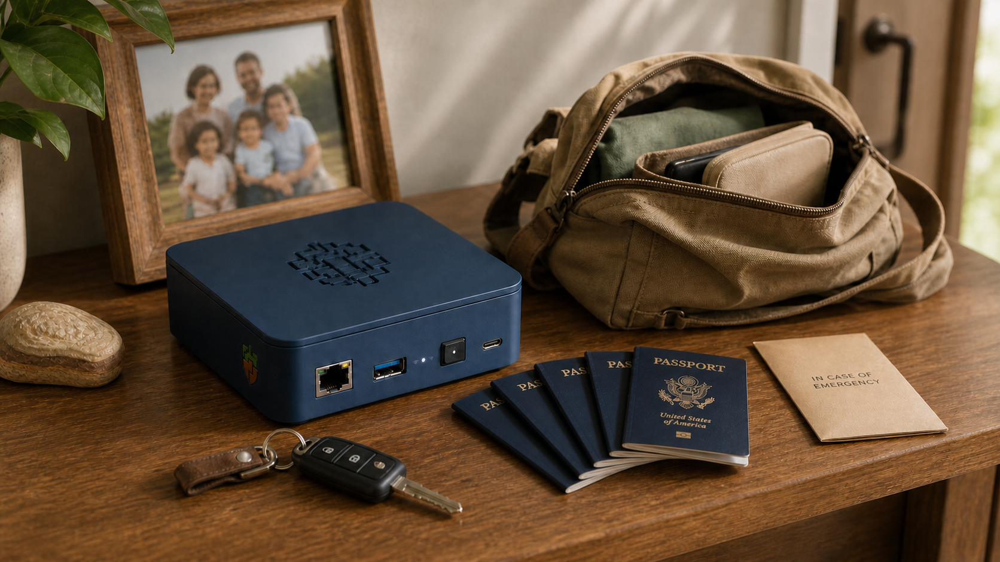

# Safebox and the digital go-bag

## Emergency funds and critical records, kept ready

Safebox is a digital go-bag: a deliberately compact collection of the funds and
records that a person, family, or community cannot afford to lose when ordinary
systems become unavailable.

Safebox is the product people use. **Acorn is the protocol-first component
inside it**, providing portable key authority, private records, funds logic,
relay-backed availability, and recovery across compatible environments.

It is not intended to be a generalized storage device, a replacement for a
cloud drive, or an archive of everything a person has ever created. Its purpose
is narrower and more consequential:

> **Safeguard the resources that must remain recoverable and usable during
> disruption.**

A Safebox might contain:

- emergency funds;
- birth certificates and civil records;
- passport and travel-document copies;
- health records, prescriptions, and care instructions;
- property, insurance, and legal records;
- emergency contacts and recovery instructions;
- community-issued records and attestations; and
- evidence needed to establish the origin, integrity, status, or control of an
  important record.

The category is defined by importance rather than volume. Safebox is designed to
hold a small number of high-value resources well.

## Digital earthquake money

Some people keep **earthquake money**: a modest reserve for transportation,
temporary accommodation, food, medicine, communication, and other immediate
needs when an emergency interrupts normal services.

Safebox applies the same preparedness logic digitally. It is not an investment
account or a complete personal archive. It is the emergency value and evidence
that should remain usable when an ordinary device, application, institution,
or network is no longer available.

> **Safebox is digital earthquake money—and the critical records a person or
> community may need after the earthquake.**

The point is not limited to earthquakes. The same preparation matters during
wildfires, floods, storms, displacement, prolonged outages, infrastructure
failure, or the sudden loss of a trusted service.

## A local home with independent continuity

One likely product form is a Safebox appliance with a local relay and an Acorn
execution environment. The appliance gives critical encrypted state a home
that remains close to the person, household, institution, or community using
it. Safebox may also be delivered through a trusted web provider or another
compatible application without changing Acorn's underlying protocol role.



*An illustrative product concept: Safebox alongside the final essentials a
family might gather before leaving home, powered by the Acorn component. Final
hardware and enclosure design may differ.*

That local home is not the only copy:

```text
local Safebox appliance
├── Acorn component, keys, and execution
├── local relay
├── emergency funds
└── critical encrypted records
         │
         ├── encrypted replica on another household appliance
         ├── encrypted replica on community infrastructure
         └── encrypted replica with selected service providers
```

Replication provides continuity across device loss, local infrastructure
failure, displacement, wildfire, flood, earthquake, service interruption, or
institutional failure. The independent hosts provide availability without
receiving normal plaintext access to the records they hold.

This is closer to a network of **reciprocal safes** than a shared folder.
Participants help preserve one another's encrypted resources while each
Safebox, through its Acorn component, retains its own keys and authority.

## If the appliance is lost

A local appliance may be damaged, destroyed, stolen, or burned along with the
building that contains it. The appliance is therefore a convenient home for a
Safebox and its Acorn component, not the final boundary of their continuity.

Recovery depends on two things remaining separate from the appliance:

1. recovery material that reconstructs the Acorn's authority; and
2. at least one reachable replica of its encrypted protocol state.

A complete recovery package may include:

- the **Safebox Acorn mnemonic**;
- the home-relay address or other replication coordinates;
- the **Protected record mnemonic**, when protected records are enabled;
- knowledge of the relevant mints; and
- any external information needed to interpret authority, attestations, or
  recovery policy.

The mnemonic should be kept somewhere that is unlikely to be destroyed in the
same incident as the appliance. Depending on the user's circumstances, that
might mean an offline physical copy, a trusted vault, a geographically
separate location, or another carefully selected recovery arrangement.

With the recovery material and a surviving replica, another Safebox or
compatible Acorn environment can reconstruct the same key authority and
retrieve the encrypted state. Recovery of ecash also remains subject to the
issuing mint's continued availability and its authoritative view of whether
the recovered proofs are spendable.

## Reciprocal resilience without shared access

A user can arrange replication with as many suitable households, communities,
institutions, or infrastructure providers as their continuity policy requires.
Each additional independent location can reduce dependence on a particular
device, building, operator, or region.

The relationship is reciprocal without becoming communal access:

> **A participant does not receive a copy of another person's open safe. Their
> infrastructure holds an encrypted, opaque replica that only the authorized
> Acorn can normally use.**

This enables a form of mutual assurance. Participants preserve one another's
ability to recover without needing to read, administer, or take ownership of
one another's contents.

The privacy claim must remain precise. Relay-held contents are encrypted and
need not disclose the real-world identity of their controller, but the system
should not describe all replicated data as perfectly anonymous. Depending on
the event format and deployment, an observer or seized appliance may still
reveal:

- pseudonymous public keys and event relationships;
- timing, volume, connection, and network metadata;
- operational logs retained by the host; and
- which ciphertext appeared on more than one relay.

A seized reciprocal relay should not disclose the plaintext records it stores
without the corresponding Acorn keys. It may still permit deletion, censorship,
or analysis of metadata. Availability is therefore protected through multiple
independent replicas rather than through encryption alone.

An appliance that also runs its owner's Acorn has a different risk: its local
key material may be exposed if the device is seized while unlocked or is not
adequately protected at rest. The appliance architecture should keep the roles
clear:

```text
relay replicas  -> encrypted data without users' decryption keys
Acorn authority -> separately protected operational keys
recovery        -> offline mnemonic plus known replica locations
```

Future appliance designs may strengthen the operational-key boundary through
encrypted local storage, secure boot, hardware-backed keys, or a dedicated
secure execution device. Those measures protect the local Acorn; they are not
required for a relay to hold other users' encrypted replicas without their
keys.

## More than a file

A photograph of a passport or a PDF copy of a birth certificate may be useful,
but the bytes alone do not answer the questions that make an important record
trustworthy.

A Safebox record, managed through Acorn, can bring together several distinct
layers:

```text
critical record
├── original record
│   └── encrypted PDF, image, or structured document
├── record metadata
│   ├── document type
│   ├── subject and issuer
│   ├── dates and jurisdiction
│   └── blob reference and cryptographic digest
├── attestations
│   ├── issuer attestation
│   ├── notarial attestation
│   └── other recognized confirmations
└── events
    ├── issuance
    ├── amendment or correction
    ├── presentation
    ├── transfer or endorsement
    ├── surrender
    ├── replacement
    └── revocation or expiry
```

The encrypted document remains available as the human-readable record. Its
cryptographic digest provides a stable reference to the exact bytes. An issuer,
notary, elder, clinic, registry, or other recognized authority can sign an
attestation referring to that digest without needing to operate the holder's
Safebox or Acorn component, or retain another plaintext copy.

A scan does not become an official passport merely because it has a hash. A
digital copy has the legal or practical authority that the applicable issuer,
community, institution, or legal framework recognizes. Safebox uses Acorn to
preserve the artifact and the evidence around it; neither manufactures
authority.

## Ancient questions, modern proofs

The underlying concepts are not new. Societies have asked the same questions
about consequential records for millennia:

1. **Artifact** — What is the record being considered?
2. **Authority** — Who issued the original or attested the facsimile?
3. **Integrity** — Is what is being presented the same as what was issued or
   examined?
4. **History** — What events have affected the record?
5. **Control** — Who can presently exercise authority over it?
6. **Rightful presentation** — Is the presenter entitled to present or control
   it?
7. **Recognition** — Does the relying party recognize the authority, rules,
   evidence, and result?

Paper systems answered these questions through originals, seals, signatures,
notaries, registries, endorsements, custody, and presentation. Acorn and its
related protocol work express the same primitives digitally:

| Enduring mechanism | Digital expression |
| --- | --- |
| Artifact or original | Exact bytes and a cryptographic digest |
| Seal or signature | Signature by an issuing or attesting key |
| Certified copy | Attestation bound to the facsimile's digest |
| Registry | Signed event history available from independent infrastructure |
| Endorsement | Signed event changing control or status |
| Possession | Evidence of control over the relevant key |
| Recognition | Decision by the community, institution, or relying party |

The protocol can prove that a particular key signed particular bytes, that a
presented artifact matches a digest, and that a sequence of signed events is
internally consistent. It cannot prove that an issuer is legitimate, that a
claim is true, that key use reflected a person's intent, or that a presenter is
legally entitled to act. Those remain questions of governance, context, and
recognition.

Safebox does not replace longstanding systems of evidence. Through Acorn, it
makes their underlying patterns portable and independently verifiable.

## Authority begins with recognition

Acorn is deliberately unopinionated about the source or scale of authority.
The same record and attestation patterns can be used by:

- a family or mutual-aid group;
- a community elder;
- an Indigenous government;
- a clinic, midwife, school, cooperative, or religious institution;
- a municipal or regional registry;
- a national civil, health, or passport authority; or
- an international organization.

A community may recognize authorities that are not recognized elsewhere. A
national system may derive authority from legislation and institutional
registries. International recognition may depend on treaties, reciprocal
agreements, cross-attestations, or established practice. The cryptographic
mechanics do not need to change as the governance scale changes.

> **Acorn records evidence of authority; it does not prescribe the source or
> scale of authority.**

Multiple attestations can coexist. A record of birth may first be attested by a
community elder, local health worker, or midwife and later receive an
attestation from a regional or national registry. The later event does not need
to erase the earlier evidence or the community context in which it mattered.

This makes the model useful where national infrastructure is absent,
inaccessible, distrusted, or temporarily unavailable. Communities can preserve
continuity using authorities they already recognize without foreclosing later
interoperability with larger institutions.

## Keys provide evidence, not identity

An authority signs through a key, but the key is not the authority itself. A
key supplies a stable protocol identifier and cryptographic evidence that it
authorized particular events.

The relying party must still determine:

- who or what controls the key;
- whether that controller is an authority for this kind of record;
- whether the key was valid at the relevant time;
- whether delegation, replacement, or compromise affected its use; and
- whether the applicable community or institution recognizes the result.

The same distinction applies to the presenter. A valid response can prove
control of a key. Rightful possession or presentation may additionally depend
on law, community rules, guardianship, delegation, institutional policy, or
other evidence outside the cryptographic exchange.

This keeps the model honest. Cryptography preserves integrity and authority
signals; people and institutions remain responsible for interpreting them.

## Non-transferable and transferable records

Many digital go-bag records are ordinarily non-transferable. A birth
certificate, passport, health record, or prescription concerns a subject and
may be presented or delegated, but it is not normally transferred to a new
owner.

For these records, the event history primarily answers:

- who issued or attested the record;
- whether the presented artifact is unchanged;
- whether it is current, amended, expired, or revoked; and
- whether the presenter is authorized to use it.

Other records are transferable. Bills of lading, warehouse receipts,
promissory instruments, and some rights-bearing records depend on who currently
controls them. A copy is not enough; the signed event history must support a
valid chain of control.

This is the connection to
[OpenETR](https://trbouma.github.io/openetr/), an open scheme for electronic
transferable records built around three primitives:

```text
object     -> the record being controlled
controller -> the key or actor able to exercise control
event      -> the signed action changing control or status
```

Acorn and OpenETR address complementary responsibilities beneath the Safebox
product experience:

| Acorn | OpenETR |
| --- | --- |
| Safekeeping of keys, funds, and private records | Durable control and event history for transferable records |
| Encrypted availability and recovery | Transfer, endorsement, and enforcement semantics |
| Holder-controlled presentation | Independent validation of the control chain |
| Digital go-bag and appliance model | Portable record-control layer |

Safebox can use Acorn to safeguard the artifact and its related evidence. The
OpenETR model can describe the control layer when transfer and current control
are essential to the record's meaning.

## Community infrastructure without isolation

Safebox does not require every person to operate a server. Different
communities can choose different operating arrangements:

- a household appliance with a local relay;
- a community-operated appliance serving several members;
- reciprocal replication between communities;
- a trusted provider offering relay and execution services; or
- a hybrid arrangement combining local and managed infrastructure.

The objective is practical independence, not solitary self-hosting. A provider
can offer support, uptime, recovery assistance, a web interface, and payment
services without becoming the only place the Acorn can exist.

This approach also avoids assuming that resilience must come from one enormous
central platform. Continuity can emerge from several modest, independently
operated systems that preserve encrypted state for one another.

## What Safebox is—and is not

| Safebox is | Safebox is not |
| --- | --- |
| A digital go-bag for high-value resources | A general-purpose cloud drive |
| A compact home for emergency funds and critical records | An archive of every file a user owns |
| A way to preserve artifacts and authority evidence | A system that decides who every community must trust |
| A local-first component with encrypted replication | A requirement that every user become a server operator |
| A holder-controlled interface to records and funds | A replacement for issuers, notaries, laws, or governance |
| A protocol foundation that can scale across institutions | A claim that cryptography alone establishes legal effect |

## Product position

> **Safebox is a digital go-bag for emergency funds and critical records. It
> enables people and communities to safeguard essential documents, preserve
> evidence of their origin and history, and maintain encrypted continuity
> across independently operated infrastructure. Safebox is powered by Acorn,
> its protocol-first component for user-controlled keys, funds, and records.**

Its technology is scale-neutral. Its authority model is contextual and plural.
Its storage model is intentionally bounded. Its value lies not in holding the
most data, but in keeping the most important resources available, intelligible,
and verifiable when they are needed most.

**Ancient questions. Modern proofs. Critical resources kept ready.**

[How Acorn works](how-acorn-works.md){ .md-button .md-button--primary }
[User-controlled architecture](user-controlled-architecture.md){ .md-button }
[Explore OpenETR](https://trbouma.github.io/openetr/){ .md-button }
